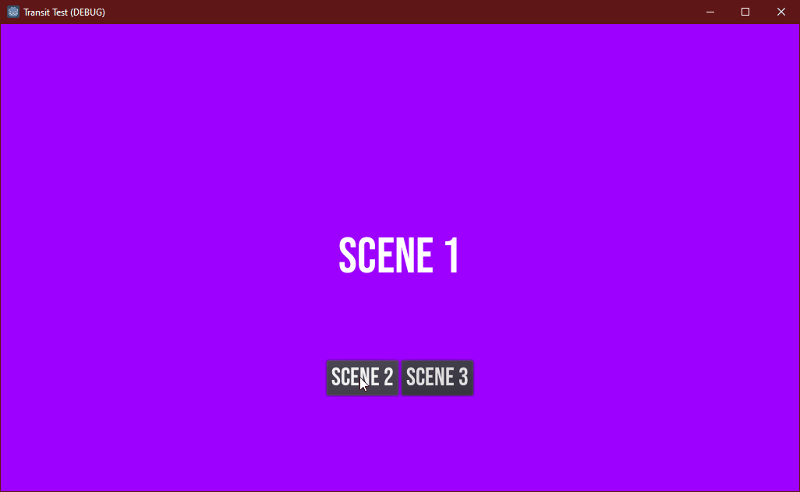

A simple Godot asset for smooth scene transitions

## Usage

Add Transit to your project. You can either install it from the Godot Asset Library, add this repository as a submodule of your project, or download `transit/Transit.gd` and `transit/Transit.tscn` into the location of your choosing.

Once you have the files in the right place, add `Transit.tscn` to your project's AutoLoad list in the project settings.


*Important: Make sure you add the scene file (ending in `.tscn`) to the AutoLoad list. Adding the GDScript file (ending in `.gd`) **will not work**.*

Now you can reference `/root/Transit` in your scripts to change scenes in much the same way you would with `SceneTree.change_scene`. For example:

```GDScript
onready var _transit := $"/root/Transit`

func on_button_pressed():
    _transit.change_scene("res://Game.tscn")
```

## Documentation

### Change Scene

`change_scene(path: String, duration: Float = 0.2, delay: float = 0)`

Fades out, calls `get_tree().change_scene(path)`, then fades back in. Emits the `scene_changed` signal once the transition is completed.

Parameters:
* `path`: The scene to change to after fading out.
* `duration`: How long in seconds the fade should last on each side of the transition. Defaults to 0.2s (200ms).
* `delay`: How long to wait before starting the transition. Defaults to 0s, i.e no delay.

Example:
```GDScript
# A simple fade transition to `Game.tscn`.
_transit.change_scene("res://Game.tscn")

# Then same as above, except each fade (out and in) takes half a second.
_transit.change_scene("res://Game.tscn", 0.5)

# The same as above, except now it waits for a full second before fading out.
_transit.change_scene("res://Game.tscn", 0.5, 1.0)
```

### Set fade-to color

`set_color(color: Color)`

Sets the intermediate color to use when fading between scenes. The default is black. This function preserves the current alpha value, which means it's safe to change colours even while a fade is in progress.

Parameters:
* `color`: The color to fade to. This is implemented as a ColorRect that exists on the highest canvas layer in the scene.

Example:
```GDScript
# Set fade color to white.
_transit.set_color(Color.white)

# This will now fade to white before changing to `Game.tscn`
_transit.change_scene("res://Game.tscn")
```

## Implementation Details

Transit works by creating a `ColorRect` on canvas layer #128 (the highest.) This `ColorRect` defaults to black with 0 alpha, with mouse filtering set to `MOUSE_FILTER_IGNORE`. When `change_scene` is called, the following process happens:
1. The `ColorRect` mouse filtering is set to `MOUSE_FILTER_STOP` to prevent further UI interaction.
2. If `delay` is larger than 0, the function yields for that amount of time.
3. An animation is played that fades the alpha value to 1 over the given time period.
4. `SceneTree.change_scene` is invoked on the current tree, changing to the requested scene.
5. The `ColorRect` mouse filtering is set back to `MOUSE_FILTER_IGNORE` to allow UI interactions.
6. The same fade animation as before is played in reverse to fade the `ColorRect` alpha back to 0.
7. The `scene_changed` signal is emitted.

## How it Looks


